# An Overview of Apple Keyboard Layouts

## The MacBook Keyboard

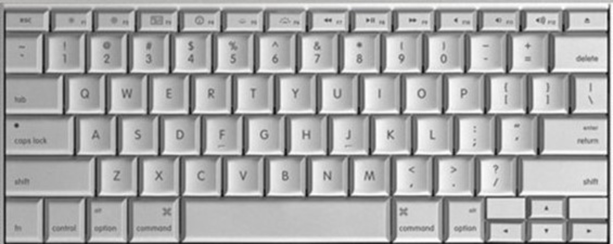

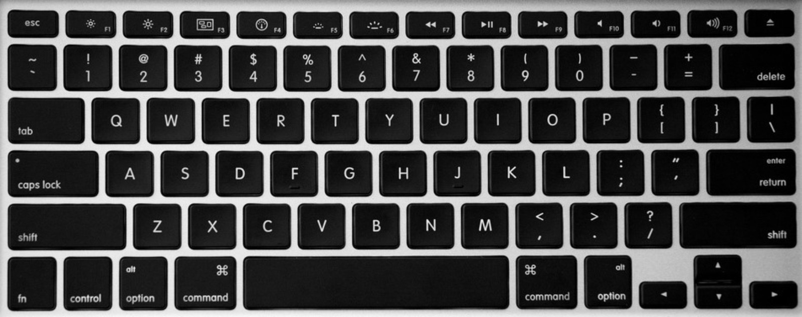

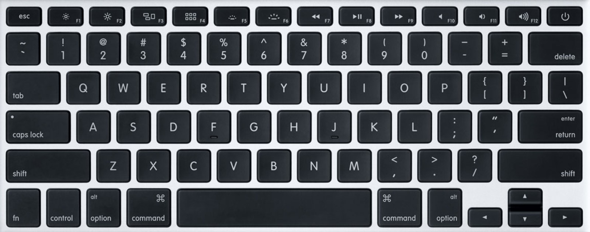

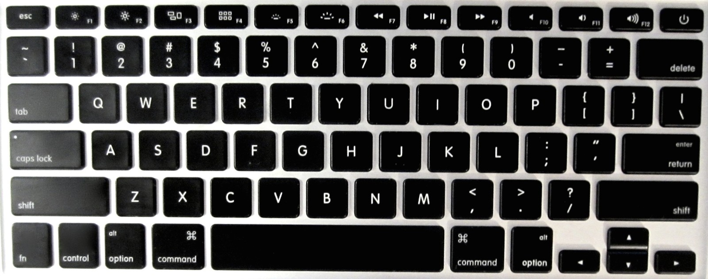

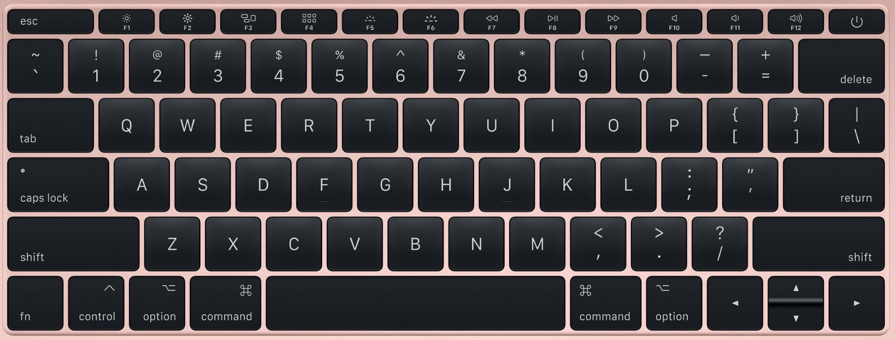

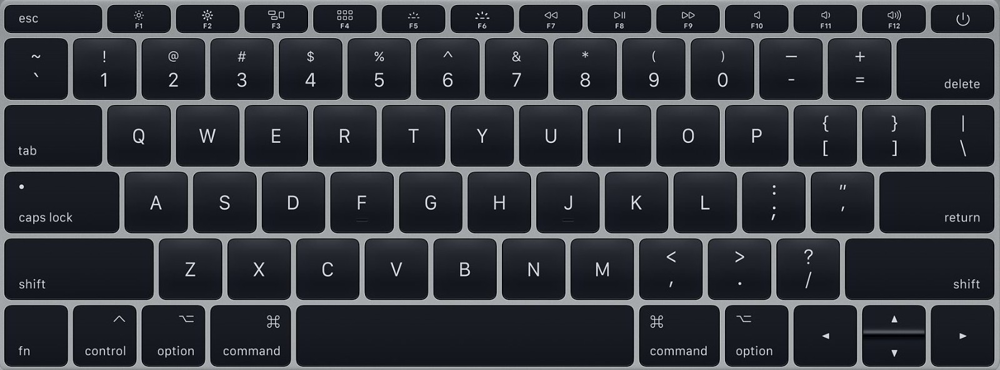

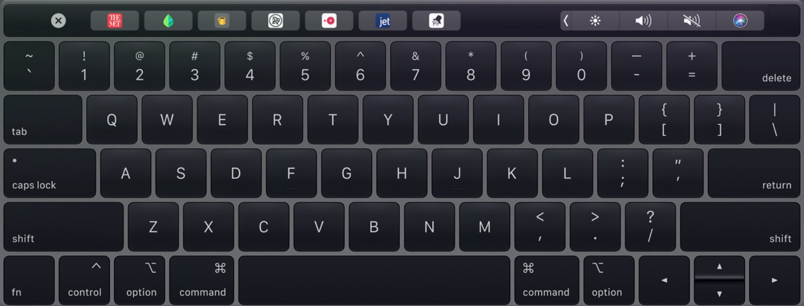

Since the first generation MacBook, the MacBook keyboard layout has not changed much. Ignoring the function row, only two minor changes have occurred. Between the third and fourth generation keyboards, the Spacebar row shrank to a one key height, and the left and right keys grew to a uniform one key height.

The function row has changed in every new MacBook generation, whether it be key shape, the included hot keys, or a touchscreen bar that replaces the keys.

I personally think that, excluding the function row, the MacBook keyboard layout is an excellent design. It is not uncomfortably radical, but it has several excellent design features. The 14.5 key width allows a *semi symmetrical layout*. The number row with a 1.5 key wide Backspace is offset by the qwerty row with a 1.5 key wide Tab. Caps Lock and Enter are the same lengths, as are both Shift keys. Despite this symmetry, which is unlike the standard ANSI keyboard, the 0.25, 0.25, 0.5 spacing of 1, Q, A, and Z is still preserved. The Spacebar is symmetric about ASDF and JKL;, and thusly, symmetric about the hands. Having the major modifier key (the Command key) to the sides of the Spacebar predates the MacBook, but its inclusion is worth mentioning all the same. This layout is arguably more efficient than having the Control key in the keyboards bottom corners, as you can hit Command without moving from home row. Additionally, this layout allows the direction keys to be included in the bottom right corner without sacrificing symmetry of the Command and Option keys, an issue that plagues Windows laptop keyboards.

## The Apple Keyboard

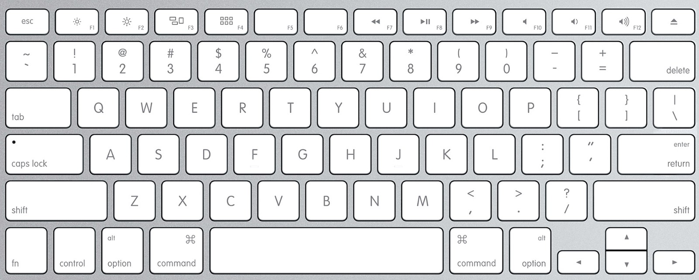

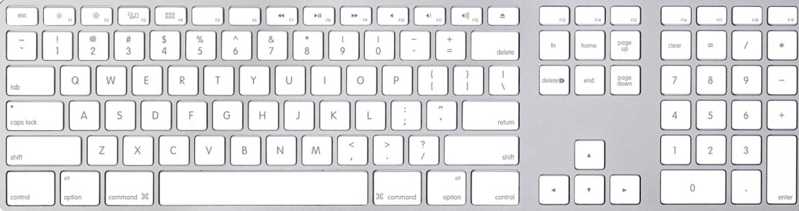

The Apple Keyboard has the same layout and aesthetic as the second generation MacBook Keyboard. The Full Apple Keyboard only adjusts the Spacebar row slightly, expanding the keyboard one key to the right and having the Command, Option, and Control keys symmetrically fill in the rest of the space.

## The Apple Magic Keyboard

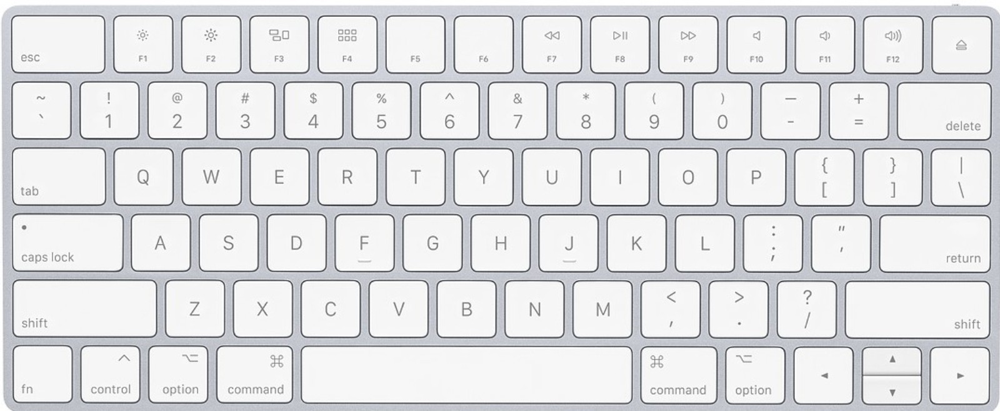

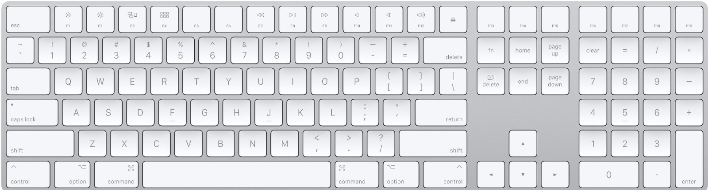

The Apple Magic Keyboard is the successor to the Apple Keyboard, and it is Apple's current promoted keyboard. The function row is expanded to a one key height, Escape is lengthened to mimic the fourth generation MacBook keyboard, and the Spacebar row is shrunk to the now standard one key height (again, just like the fourth generation MacBook keyboard). The hot keys are kept the same, with the still annoyingly empty F6 and F7 keys.
