# Keyboard Ideas

Note: *u* stands for *units*. For example, a character key such as `A`, `!`, or `1` is 1u high and 1u wide. `Spacebar` is usually between 5u and 6u wide.

## Splitting the Spacebar

Why not have a split Spacebar? Most people use one thumb for Spacebar, so the unused thumb's potential is wasted. What key would the second Spacebar be? It could be anything, but I believe that Backspace is the best choice. In a standard keyboard layout, Backspace is inefficiently placed even though it is the second most frequently hit key. Assigning Backspace to the thumb would greatly increase typing efficiency and hand health. Finally, for those who do prefer to use both thumbs to hit Spacebar, it is easy to revert to a full Spacebar by programming both Spacebar halves as Spacebar.

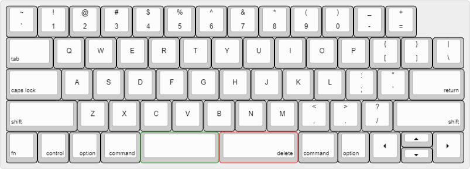

## Switching Caps Lock with Escape

Caps Lock is seldom used, so why have it in such a prime key location next to the left pinky? Why not have Escape, a more commonly used key, in its place?

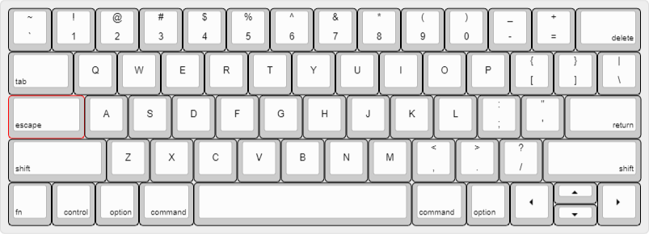

## Different Navigation Clusters

The arrow key cluster in the bottom right corner of laptop keyboards is ubiquitous. Although it is comforting to have a dedicated arrow key cluster, its prevents the keyboard from having a right Control key, crucial for Windows users (Mac users do not have this problem as Command and Option are both activated by the thumbs). Is there a way to have an arrow key cluster without sacrificing the right Control key?

One possibility is to have a completely separate navigation cluster:

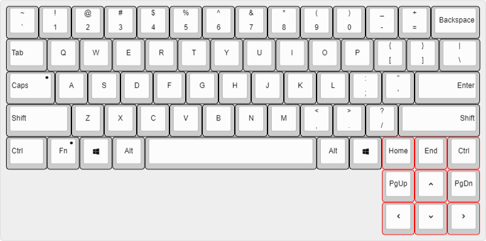

Another possibility is to shorten the spacebar:

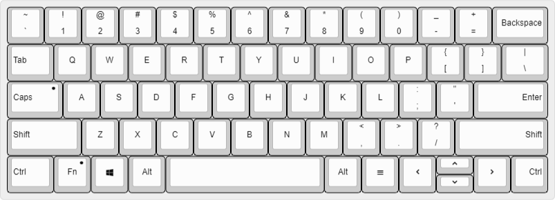

Or remove the menu/right window key:

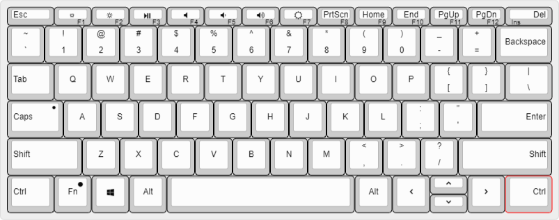

Another (weirder) possibility is to have a function activated vim like navigation cluster. To prevent hampering key chord combinations, it would be best if the navigation cluster was activated by its congruent hand (thus, the congruent thumb). I will note that there are keyboards, such as the Poker 60% series, that have a special layer key where Caps Lock is to activate a right hand IJKL navigation cluster.

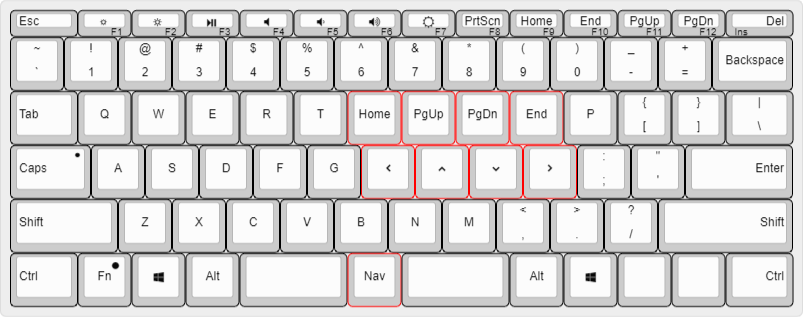

## Flexible Hotkey Layer

Some people complain about new laptop keyboards not having dedicated function keys and pause/break/etc. keys. This gripe could be quelled with a seven layer keyboard with one or maybe two programmable hotkey layer. (I personally think function keys should have there own dedicated buttons.)

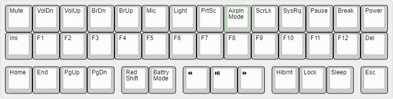

## Standard vs. Balanced Core

### ANSI Core Layout

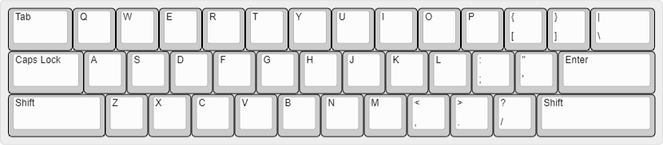

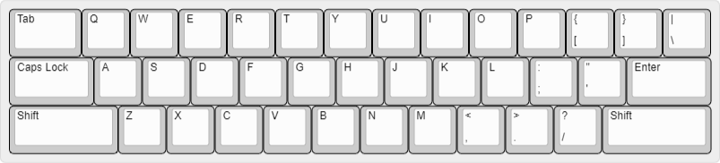

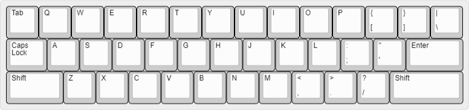

Several variations of the ANSI keyboard core. Notice that `Q` and `A` are offset by 0.25u, and `A` and `Z` are offset by 0.5u. This design choice was inspired by the QWERTY typewriter.

However, what if `Q` and `A` were offset by 0.5u? This thought inspired the following "balanced" layouts.

Some other notes: The 15u ANSI core is the official ANSI core. The 14.5u ANSI core is most prominently seen in Apple keyboards. I have seen a 14u ANSI core on Dell 11 inch Inspiron laptops.

### Balanced Core Layout

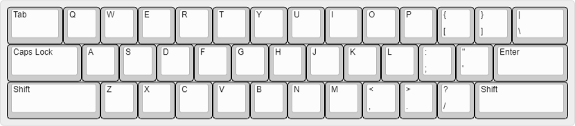

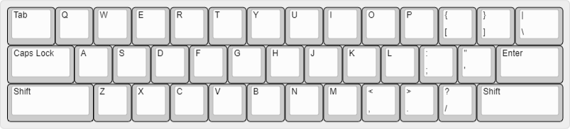

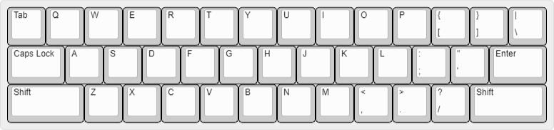

A balanced ANSI keyboard layout. Notice how 'Q', 'A', and 'Z' are all offset 0.5u. The keyboard is semi-symmetrical; if the `/` `''` `]` diagonal was removed, the keyboard would be completely symmetrical about `G` and `H`. This design offers two benefits. First, it allows a symmetrical reach between the index fingers hitting `V` `B` and `U` `Y`. (This would be most beneficial to touch type beginners.) Second, the `[` and `]` keys would be closer to the pinky and thus easier to touch type.

**Breaking news: Microsoft's Surface Go is the first computer to have an essentially balanced core keyboard layout.**

---
---
---

# Personal Keyboard Ideas

*Note: A 40% 14u is possible, but offers little benefit over a 40% 13u.*

### 40% 13u

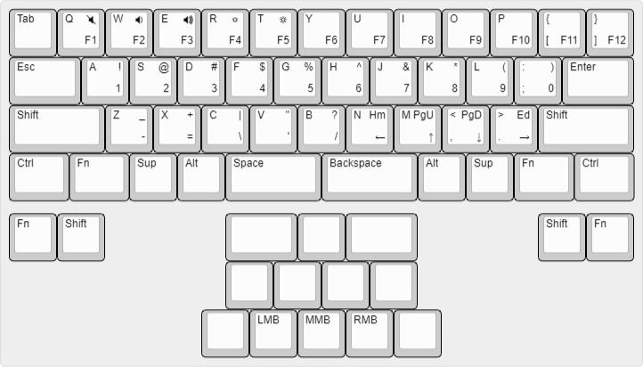
```
["Tab","Q\n\n<i class='kb kb-Multimedia-Mute-2'></i>\nF1","W\n\n<i class='kb kb-Multimedia-Volume-Down-2'></i>\nF2","E\n\n<i class='kb kb-Multimedia-Volume-Up-2'></i>\nF3","R\n\n<i class='kb kb-Unicode-Screen-Dim'></i>\nF4","T\n\n<i class='kb kb-Unicode-Screen-Bright'></i>\nF5","Y\n\n\nF6","U\n\n\nF7","I\n\n\nF8","O\n\n\nF9","P\n\n\nF10","{\n[\n\nF11","}\n]\n\nF12"],
[{w:1.5},"Esc","A\n\n!\n1","S\n\n@\n2","D\n\n#\n3","F\n\n$\n4","G\n\n%\n5","H\n\n^\n6","J\n\n&\n7","K\n\n*\n8","L\n\n(\n9",":\n;\n)\n0",{w:1.5},"Enter"],
[{w:2},"Shift","Z\n\n_\n-","X\n\n+\n=","C\n\n|\n\\","V\n\n\"\n'","B\n\n?\n/","N\n\nHm\n&larr;","M\n\nPgU\n&uarr;","<\n,\nPgD\n&darr;",">\n.\nEd\n&rarr;",{w:2},"Shift"],
[{w:1.25},"Ctrl",{w:1.25},"Fn","Sup","Alt",{w:2},"Space",{w:2},"Backspace","Alt","Sup",{w:1.25},"Fn",{w:1.25},"Ctrl"],
[{y:0.25},"Fn","Shift",{x:2.5,a:7,w:1.5},"","",{w:1.5},"",{x:2.5,a:4},"Shift","Fn"],
[{x:4.5,a:7},"","","",""],
[{x:4},"",{a:4},"LMB","MMB","RMB",{a:7},""]
```

### 40% 12u
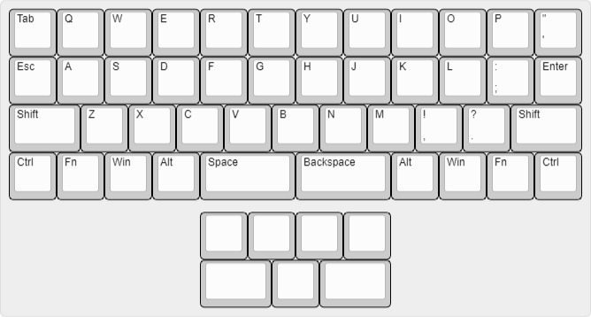
```
["Tab","Q","W","E","R","T","Y","U","I","O","P","\"\n'"],
["Esc","A","S","D","F","G","H","J","K","L",":\n;","Enter"],
[{w:1.5},"Shift","Z","X","C","V","B","N","M","!\n,","?\n.",{w:1.5},"Shift"],
["Ctrl","Fn","Win","Alt",{w:2},"Space",{w:2},"Backspace","Alt","Win","Fn","Ctrl"],
[{y:0.25,x:4,a:7,w:1.5},"","",{w:1.5},""],
[{x:4},"","","",""]
```

### Laptop 14u

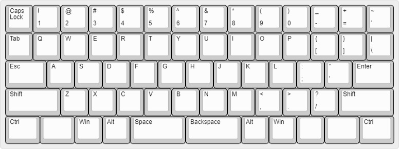

```
["Caps Lock","!\n1","@\n2","#\n3","$\n4","%\n5","^\n6","&\n7","*\n8","(\n9",")\n0","_\n-","+\n=","~\n`"],
["Tab","Q","W","E","R","T","Y","U","I","O","P","{\n[","}\n]","|\n\\"],
[{w:1.5},"Esc","A","S","D","F","G","H","J","K","L",":\n;","\"\n'",{w:1.5},"Enter"],
[{w:2},"Shift","Z","X","C","V","B","N","M","<\n,",">\n.","?\n/",{w:2},"Shift"],
[{w:1.25},"Ctrl",{a:7},"",{a:4},"Win","Alt",{x:2.25,w:2.25},"Backspace","Alt","Win",{a:7},"","",{a:4,w:1.25},"Ctrl"],
[{rx:0.25,y:4,x:4,w:2.25},"Space"]
```

### Planck - Base Layer

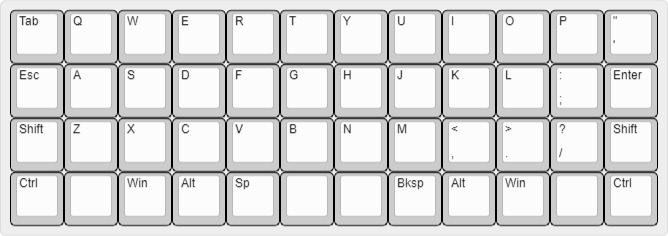

```
["Tab","Q","W","E","R","T","Y","U","I","O","P","\"\n'"],
["Esc","A","S","D","F","G","H","J","K","L",":\n;","Enter"],
["Shift","Z","X","C","V","B","N","M","<\n,",">\n.","?\n/","Shift"],
["Ctrl",{a:7},"",{a:4},"Win","Alt","Sp",{a:7},"","",{a:4},"Bksp","Alt","Win",{a:7},"",{a:4},"Ctrl"]
```

### Planck - Layer 1

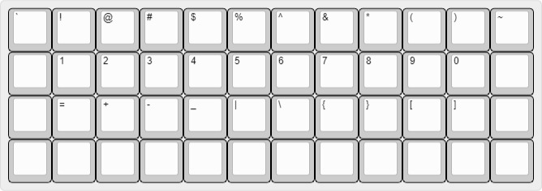

```
["`","1","2","3","4","[","]","!","@","#","$","~"],
[{a:7},"",{a:4},"5","6","7","8","(",")","%","^","&","*",{a:7},""],
["",{a:4},"9","0","-","=","{","}","_","+","\\","|",{a:7},""],
["","","","","","","","","","","",""]
```

### Planck - Layer 1 Alt

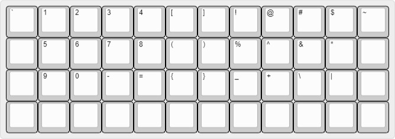

```
["`","!","@","#","$","%","^","&","*","(",")","~"],
[{a:7},"",{a:4},"1","2","3","4","5","6","7","8","9","0",{a:7},""],
["",{a:4},"=","+","-","_","|","\\","{","}","[","]",{a:7},""],
["","","","","","","","","","","",""]
```

### Planck - Layer 2

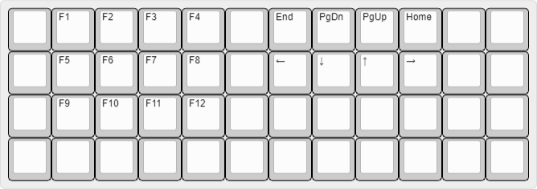

```
[{a:7},"",{a:4},"F1","F2","F3","F4",{a:7},"",{a:4},"End","PgDn","PgUp","Home",{a:7},"",""],
["",{a:4},"F5","F6","F7","F8",{a:7},"",{a:4},"&larr;","&darr;","&uarr;","&rarr;",{a:7},"",""],
["",{a:4},"F9","F10","F11","F12",{a:7},"","","","","","",""],
["","","","","","","","","","","",""]
```

### Planck - Layer 3

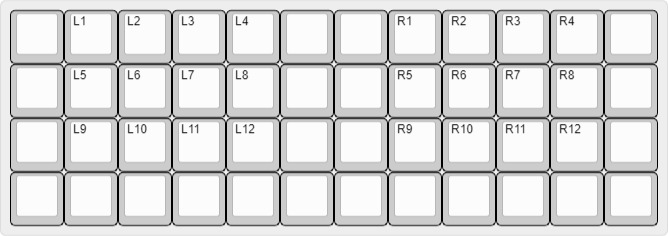

```
[{a:7},"",{a:4},"L1","L2","L3","L4",{a:7},"","",{a:4},"R1","R2","R3","R4",{a:7},""],
["",{a:4},"L5","L6","L7","L8",{a:7},"","",{a:4},"R5","R6","R7","R8",{a:7},""],
["",{a:4},"L9","L10","L11","L12",{a:7},"","",{a:4},"R9","R10","R11","R12",{a:7},""],
["","","","","","","","","","","",""]
```

### Macbook

```
[{a:5},"~\n`","!\n1","@\n2","#\n3","$\n4","%\n5","^\n6","&\n7","*\n8","(\n9",")\n0","_\n-","+\n=",{a:4,f:2,w:1.5},"\n\n\ndelete"],
[{w:1.5},"\ntab",{a:7,f:3},"Q","W","E","R","T","Y","U","I","O","P",{a:5},"{\n[","}\n]","|\n\\"],
[{a:4,f:2,w:1.75},"\ncaps lock",{a:7,f:3},"A","S","D","F","G","H","J","K","L",{a:5},":\n;","\"\n'",{a:4,f:2,w:1.75},"\n\n\nreturn"],
[{w:2.25},"\nshift",{a:7,f:3},"Z","X","C","V","B","N","M",{a:5},"<\n,",">\n.","?\n/",{a:4,f:2,w:2.25},"\n\n\nshift"],
["\nfn","\n\n\ncontrol","\n\n\noption",{w:1.25},"\n\n\ncommand",{a:7,f:3,w:5},"",{a:4,f:2,w:1.25},"\ncommand","\noption",{a:7,f:3},"<i class='kb kb-Multimedia-Back'></i>",{h:0.5},"<i class='kb kb-Multimedia-Up'></i>","<i class='kb kb-Multimedia-Play'></i>"],
[{y:-0.5,x:12.5,h:0.5},"<i class='kb kb-Multimedia-Down'></i>"]
```

### Thinkpad X1 Carbon (All gen except 2nd)

```
[{a:6,w:1.5,h:0.6},"Esc",{x:9,a:7,h:0.6},"Home",{h:0.6},"End",{h:0.6},"Insert",{a:6,w:1.5,h:0.6},"\n\nDelete"],
[{ry:0.25,y:0.5,a:4},"~\n`","!\n1","@\n2","#\n3","$\n4","%\n5","^\n6","&\n7","*\n8","(\n9",")\n0","_\n-","+\n=",{a:6,w:2},"\n\nBackspace"],
[{w:1.5},"Tab",{a:4},"Q","W","E","R","T","Y","U","I","O","P","{\n[","}\n]",{w:1.5},"|\n\\"],
[{a:6,w:1.75},"Caps Lock",{a:4},"A","S","D","F","G","H","J","K","L",":\n;","\"\n'",{a:6,w:2.25},"\n\nEnter"],
[{w:2.25},"Shift",{a:4},"Z","X","C","V","B","N","M","<\n,",">\n.","?\n/",{a:6,w:2.75},"\n\nShift"],
["Fn",{w:1.25},"Ctrl",{a:7},"<i class='kb kb-logo-windows-8'></i>","Alt",{w:5},"",{a:6},"Alt","PrtSc","Ctrl",{w:0.9,h:0.7},"PgUp",{x:0.03,a:7,w:0.9,h:0.7},"<i class='kb kb-Multimedia-Up'></i>",{x:0.02,a:6,w:0.9,h:0.7},"\n\nPgDn"],
[{y:-0.25,x:12.25,w:0.9,h:0.7},"<i class='kb kb-Multimedia-Back'></i>",{x:0.03,a:7,w:0.9,h:0.7},"<i class='kb kb-Multimedia-Down'></i>",{x:0.02,a:6,w:0.9,h:0.7},"\n\n<i class='kb kb-Multimedia-Play'></i>"]
```

### Surface Pro 4/5 Type Cover

```
[{a:6,w:1.25,h:0.5},"Esc",{a:3,f:1,fa:[3],h:0.5},"<i class='kb kb-Unicode-Screen-Dim'></i>\n\n\n\n\nF1",{f:3,h:0.5},"<i class='kb kb-Unicode-Screen-Bright'></i>\n\n\n\n\nF2",{h:0.5},"<i class='kb kb-Multimedia-Play-Pause'></i>\n\n\n\n\nF3",{h:0.5},"<i class='fa fa-volume-off'></i>\n\n\n\n\nF4",{h:0.5},"<i class='fa fa-volume-down'></i>\n\n\n\n\nF5",{h:0.5},"<i class='fa fa-volume-up'></i>\n\n\n\n\nF6",{h:0.5},"<i class='fa fa-sun-o'></i>\n\n\n\n\nF7",{h:0.5},"PrtScn\n\n\n\n\nF8",{h:0.5},"Home\n\n\n\n\nF9",{h:0.5},"End\n\n\n\n\nF10",{h:0.5},"PgUp\n\n\n\n\nF11",{h:0.5},"PgDn\n\n\n\n\nF12",{a:2,w:1.25,h:0.5},"\n\nDel\n\nIns"],
[{y:-0.5,a:5},"~\n`","!\n1","@\n2","#\n3","$\n4","%\n5","^\n6","&\n7","*\n8","(\n9",")\n0","_\n-","+\n=",{a:6,w:1.5},"\n\nBackspace"],
[{w:1.25},"Tab",{a:7},"Q","W","E","R","T","Y","U","I","O","P",{a:5},"{\n[","}\n]",{w:1.25},"|\n\\"],
[{a:4,fa:[0,0,1],w:1.5},"\n\n<i class='kb kb-Multimedia-Record'></i>\n\n\n\nCaps",{a:7},"A","S","D","F","G","H","J","K","L",{a:5},":\n;","\"\n'",{a:6,f:3,w:2},"\n\nEnter"],
[{w:2},"Shift",{a:7},"Z","X","C","V","B","N","M",{a:5},"<\n,",">\n.","?\n/",{a:6,f:3,w:2.5},"\n\nShift"],
[{w:1.25},"Ctrl",{a:4},"\n\n<i class='kb kb-Multimedia-Record'></i>\n\n\n\n\n\n\nFn",{a:7,fa:[2]},"<i class='kb kb-logo-windows-8'></i>",{f:3},"Alt",{w:5.25},"",{f:3},"Alt",{f:3},"<i class='kb kb-Hamburger-Menu'></i>",{fa:[1]},"<i class='fa fa-chevron-left'></i>",{h:0.5},"<i class='fa fa-chevron-up'></i>","<i class='fa fa-chevron-right'></i>"],
[{y:-0.5,x:12.5,h:0.5},"<i class='fa fa-chevron-down'></i>"]
```

### Theoretical - Symmetric 14u

```
[{a:7},"",{a:4},"!\n1","@\n2","#\n3","$\n4","%\n5","^\n6","&\n7","*\n8","(\n9",")\n0","_\n-","+\n=","~\n`"],
[{a:7,w:1.5},"",{a:4},"Q","W","E","R","T","Y","U","I","O","{\n[","}\n]",{a:7,w:1.5},""],
["",{a:4},"|\n\\","A","S","D","F","G","H","J","K","L",":\n;","\"\n'",{a:7},""],
[{a:4,w:1.5},"Shft","?\n/","Z","X","C","V","B","N","M","P","<\n,",">\n.",{w:1.5},"Shft"],
["Ctrl",{a:7},"","",{a:4},"Super","Alt",{x:4},"Alt","Super",{a:7},"","",{a:4},"Ctrl"],
[{rx:0.25,y:4,x:4.75,w:2},"Space",{w:2},"Bksp"]
```

### Theoretical - Symmetric 15u

```
["Caps Lock",{a:7},"",{a:4},"!\n1","@\n2","#\n3","$\n4","%\n5","^\n6","&\n7","*\n8","(\n9",")\n0","_\n-","+\n=","~\n`"],
["Tab",{a:7},"",{a:4},"Q","W","E","R","T","Y","U","I","O","P","{\n[","}\n]","|\n\\"],
[{w:1.5},"Esc",{a:7},"",{a:4},"A","S","D","F","G","H","J","K","L",":\n;","\"\n'",{w:1.5},"Enter"],
[{w:2},"Shift",{a:7},"",{a:4},"Z","X","C","V","B","N","M","<\n,",">\n.","?\n/",{w:2},"Shift"],
[{w:1.5},"Ctrl",{a:7},"","",{a:4},"Super","Alt",{w:2},"Sp",{w:2},"Bksp","Alt","Super",{a:7},"","",{a:4,w:1.5},"Ctrl"]
```

### Theoretical - Semi-Symmetric 14u

```
[{a:7},"",{a:4},"!\n1","@\n2","#\n3","$\n4","%\n5","^\n6","&\n7","*\n8","(\n9",")\n0","_\n-","+\n=","~\n`"],
[{a:7},"",{a:4},"Q","W","E","R","T","Y","U","I","O","P","{\n[","}\n]","|\n\\"],
[{a:7,w:1.5},"",{a:4},"A","S","D","F","G","H","J","K","L",":\n;","\"\n'",{a:7,w:1.5},""],
[{a:4,w:2},"Shift","Z","X","C","V","B","N","M","<\n,",">\n.","?\n/",{w:2},"Shift"],
[{w:1.25},"Ctrl",{a:7,w:1.25},"",{a:4},"Super","Alt",{w:2},"Sp",{w:2},"Bksp","Alt","Super",{a:7},"",{w:1.25},"",{a:4,w:1.25},"Ctrl"]
```

### Theoretical - Semi-Symmetric 15u

```
[{a:7},"",{a:4},"!\n1","@\n2","#\n3","$\n4","%\n5","^\n6","&\n7","*\n8","(\n9",")\n0","_\n-","+\n=","|\n\\","~\n`"],
[{y:3,a:7},"","",{x:1,a:4},"Super","Alt",{x:2,w:2},"Bksp","Alt","Super",{x:1,a:7},"","",""],
[{rx:0.25,ry:0.25,y:0.75,x:-0.25,w:1.5},"",{a:4},"Q","W","E","R","T","Y","U","I","O","P","{\n[","}\n]",{a:7,w:1.5},""],
[{x:-0.25,w:2},"",{a:4},"A","S","D","F","G","H","J","K","L",":\n;","\"\n'",{a:7,w:2},""],
[{x:-0.25,a:4,w:2.5},"Shift","Z","X","C","V","B","N","M","<\n,",">\n.","?\n/",{w:2.5},"Shift"],
[{x:1.75,a:7},"",{x:8},""],
[{rx:0.5,ry:0,y:4,x:4.5,a:4,w:2},"Sp"]
```

### Core - ANSI Modified 14u

```
["Tab","Q","W","E","R","T","Y","U","I","O","P","{\n[","}\n]","|\n\\"],
[{w:1.25},"Caps Lock","A","S","D","F","G","H","J","K","L",":\n;","\"\n'",{w:1.75},"Enter"],
[{w:1.75},"Shift","Z","X","C","V","B","N","M","<\n,",">\n.","?\n/",{w:2.25},"Shift"]
```

### Core - ANSI Modified 14.5u

```
[{w:1.5},"Tab","Q","W","E","R","T","Y","U","I","O","P","{\n[","}\n]","|\n\\"],
[{w:1.75},"Caps Lock","A","S","D","F","G","H","J","K","L",":\n;","\"\n'",{w:1.75},"Enter"],
[{w:2.25},"Shift","Z","X","C","V","B","N","M","<\n,",">\n.","?\n/",{w:2.25},"Shift"]
```

### Core - ANSI Modified 15u

```
[{w:1.5},"Tab","Q","W","E","R","T","Y","U","I","O","P","{\n[","}\n]",{w:1.5},"|\n\\"],
[{w:1.75},"Caps Lock","A","S","D","F","G","H","J","K","L",":\n;","\"\n'",{w:2.25},"Enter"],
[{w:2.25},"Shift","Z","X","C","V","B","N","M","<\n,",">\n.","?\n/",{w:2.75},"Shift"]
```

### Core - Balanced 14u

```
["Tab","Q","W","E","R","T","Y","U","I","O","P","{\n[","}\n]","|\n\\"],
[{w:1.5},"Caps Lock","A","S","D","F","G","H","J","K","L",":\n;","\"\n'",{w:1.5},"Enter"],
[{w:2},"Shift","Z","X","C","V","B","N","M","<\n,",">\n.","?\n/",{w:2},"Shift"]
```

### Core - Balanced 14.5u

```
[{w:1.25},"Tab","Q","W","E","R","T","Y","U","I","O","P","{\n[","}\n]",{w:1.25},"|\n\\"],
[{w:1.75},"Caps Lock","A","S","D","F","G","H","J","K","L",":\n;","\"\n'",{w:1.75},"Enter"],
[{w:2.25},"Shift","Z","X","C","V","B","N","M","<\n,",">\n.","?\n/",{w:2.25},"Shift"]
```

### Core - Balanced 15u

```
[{w:1.5},"Tab","Q","W","E","R","T","Y","U","I","O","P","{\n[","}\n]",{w:1.5},"|\n\\"],
[{w:2},"Caps Lock","A","S","D","F","G","H","J","K","L",":\n;","\"\n'",{w:2},"Enter"],
[{w:2.5},"Shift","Z","X","C","V","B","N","M","<\n,",">\n.","?\n/",{w:2.5},"Shift"]
```

### Function Layer Ideas

```
["Mute","VolDn","VolUp","BrDn","BrUp","Mic","Light","PrtSc","<i class='kb kb-Multimedia-Rewind'></i>","<i class='kb kb-Multimedia-Play-Pause'></i>","<i class='kb kb-Multimedia-FastForwar'></i>",{x:2},"Power"],
["Ins","F1","F2","F3","F4","F5","F6","F7","F8","F9","F10","F11","F12","Del"],
[{y:0.25},"Ctrl","Fn","Super","Alt",{x:2.5,w:2.5},"Bksp","Alt","Super","Home","End","Ctrl"],
[{x:5},"LMB","MMB","RMB",{x:3},"PgUp","Up","PgDn"],
["ScrLk","SysRq","Pause","Break","Night Light","Battry Mode","Airpln Mode","Hibrnt","Lock","Sleep",{x:1},"Left","Down","Right"],
[{rx:0.5,y:2.25,x:3.5,w:2.5},"Sp"]
```

### Preonic

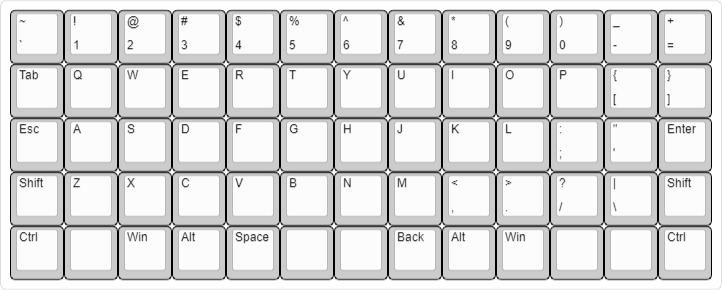

```
["~\n`","!\n1","@\n2","#\n3","$\n4","%\n5","^\n6","&\n7","*\n8","(\n9",")\n0","_\n-","+\n="],
["Tab","Q","W","E","R","T","Y","U","I","O","P","{\n[","}\n]"],
["Esc","A","S","D","F","G","H","J","K","L",":\n;","\"\n'","Enter"],
["Shift","Z","X","C","V","B","N","M","<\n,",">\n.","?\n/","|\n\\"],
["Ctrl",{a:7},"",{a:4},"Win","Alt","Space",{a:7},"","",{a:4},"Back","Alt","Win",{a:7},"","",{a:4},"Ctrl"],
[{rx:0.25,y:3,x:11.75},"Shift"]
```
