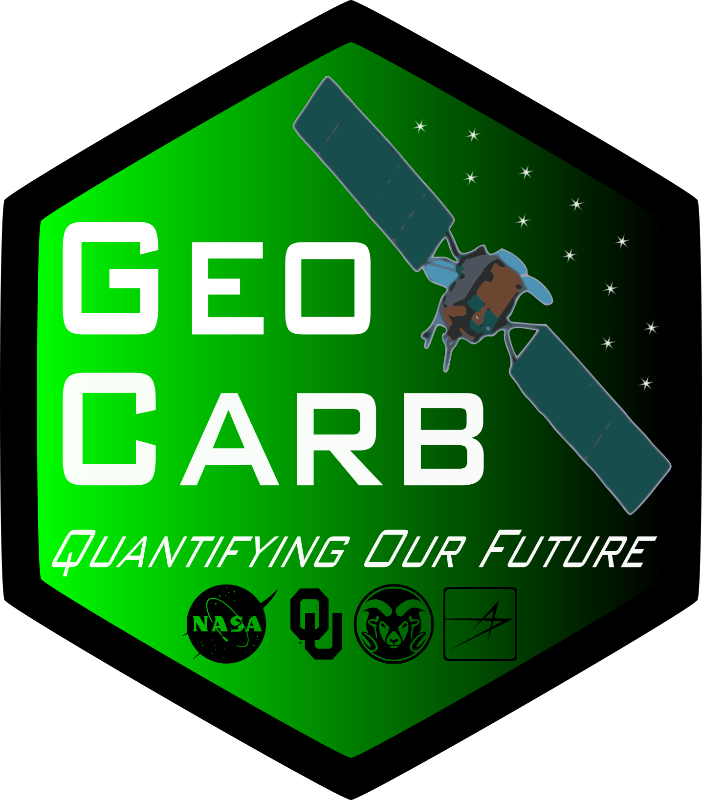

# NASA Logo Project

This was a small project I did during my freshman year of college at the University of Oklahoma. OU had recently won a grant to build a spacecraft payload to monitor vegetation health in the Americas. The project's name was GeoCarb, and a competition was issued to design a logo for the project. Although I did not win, it was a fun small project, and I got to learn the basics of Inkscape.

These are the two logos I designed:  

This is some extra description text I submitted with my logos:

> 1. Because the logos have black borders, please view them against a white background.
2. Logo References:
  - The logo is six sided to represent carbon, the sixth element.
  - The twelve stars that line the satellite on the logo's right references carbon-12, the most abundant stable isotope of carbon. Carbon-12's abundance also happens to be due to the triple-alpha process that occurs in stars.
  - Although the GeoCarb mission primarily deals with monitoring vegetation stress and measuring carbon gasses in the atmosphere, I decided that a black border, representing coal, would be interesting possibility, because coal is something that comes to most people's minds when thinking about carbon and greenhouse gases.
  - The white GeoCarb and slogan text offers striking contrast against the green-black background, and it emphasizes the positive, world (or specifically Americas) improving impact that the mission strives for.
  - The hopefully-not-to-cheesy "Quantifying Our/The Future" slogan stands for the "unprecedented detailed data" the instruments will collect, which will be used to "verify emissions treaties between nations and smaller geopolitical regions."
3. I have submitted two very similar example logos, and to account for flexibility, several parameters may be customized as desired by professional opinion. (This is analogous to having a menu with two premade special hamburgers listed, and an option to create your own hamburger.)
  - The phrase "Quantifying Our World" or "Quantifying The World" may be used.
  - If four organization logos are to be included in the logo, a linear or rhombus layout may be used.
  - Additionally, including two, three, or five organization logos is also possible.
  - The organization logos may be either monochromatic (as exampled with black in one of the logos, but any other color may be easily done) or color.
4. Finally, although I know the judges are very busy people, but if you are graciously willing to, I would greatly appreciate the most critical and detailed feedback of all sorts to help me improve my logo making abilities for the future. Thank you.
